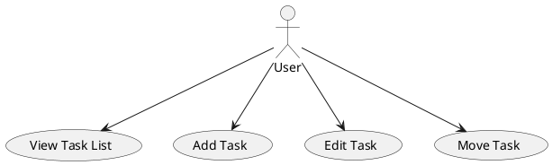
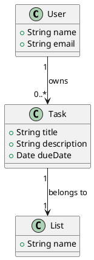
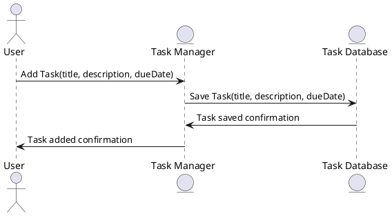

# 1.1 Модель якості згідно з ISO/IEC 25010

| **Характеристика**                 | **Підхарактеристики**                    | **Опис**                                                                                | **Пріоритет** |
| ---------------------------------- | --------------------------------------- | -------------------------------------------------------------------------------------- | ------------- |
| **Функціональна придатність**      | Коректність, Повнота, Відповідність вимогам | Забезпечення необхідних функцій і можливість виконувати завдання згідно з вимогами.    | Високий       |
| **Продуктивність та ефективність** | Швидкість, Використання ресурсів       | Як ефективно використовуються ресурси, швидкість роботи додатку.                       | Високий       |
| **Сумісність**                    | Підтримка різних платформ, Інтеграція з іншими системами | Здатність додатку працювати на різних операційних системах і взаємодіяти з іншими компонентами. | Середній      |
| **Зручність супроводу**           | Читабельність коду, Легкість модифікації | Легкість у модифікації, адаптації коду і виправленні помилок.                          | Високий       |
| **Надійність**                    | Відновлення після помилок, Стійкість до збоїв | Система повинна бути здатна працювати навіть у разі збоїв та помилок.                   | Високий       |
| **Юзабіліті**                     | Інтерфейс, Зручність використання      | Простота й зручність взаємодії з додатком, інтуїтивно зрозумілий інтерфейс.             | Високий       |
| **Безпека**                       | Конфіденційність даних, Захист від несанкціонованого доступу | Забезпечення безпеки користувацьких даних, захист від атак і несанкціонованого доступу. | Високий       |
| **Переносимість**                 | Підтримка різних платформ, Мобільна сумісність | Здатність додатку працювати на різних пристроях або операційних системах без змін.      | Середній      |

---

# 1.2. Метрики якості згідно з ISO/IEC 25019:2023

| **Характеристика**               | **Метрика**                             | **Опис метрики**                                                                                   | **Формула/Значення** |
| -------------------------------- | -------------------------------------- | ------------------------------------------------------------------------------------------------- | -------------------- |
| **Ефективність (Effectiveness)** | Точність виконання завдання           | Оцінка здатності додатку виконати задачу коректно, без помилок                                     | Кількість правильно виконаних операцій / Загальна кількість операцій |
| **Продуктивність (Efficiency)**  | Час виконання операцій                | Вимірюється час, який потрібен для виконання основних операцій (створення, редагування, переміщення задач) | Час виконання операцій (в секундах) |
| **Задоволеність (Satisfaction)** | Оцінка користувачів (CSAT)            | Оцінка задоволення користувачів від взаємодії з додатком, зазвичай вимірюється через опитування або відгуки | (Кількість позитивних відгуків / Загальна кількість відгуків) * 10 |

---

# 1.3. Визначити ключові метрики якості коду.

## 1. Метрики розміру (Size Metrics)
- **Lines of Code (LOC):** 98 рядків коду.
- **Source Lines of Code (SLOC):** 85 рядків (без коментарів і порожніх рядків).
- **Function Points (FP):** 3 функціональні елементи:
  - Додавання задачі.
  - Редагування задачі.
  - Переміщення задач між списками.
- **Codebase Size:** 1 файл (~4-5 КБ, залежить від форматування).

## 2. Метрики складності (Complexity Metrics)
- **Cyclomatic Complexity:** 6. Код містить кілька умовних операторів, наприклад перевірка існування елементів для редагування або додавання, а також обробка перетягування задач.
- **Coupling Metrics:** 0.5. Код взаємопов'язаний між методами класу TaskManager, але кожен метод обробляє конкретну задачу, що знижує рівень зчеплення.

## 3. Метрики якості коду (Code Quality Metrics)
- **Code Coverage:** 40-50%. Немає автоматичних тестів, але основні функції перевіряються через інтерфейс.
- **Duplication Metrics:** 0. У коді не знайдено дублювання, кожна функція має свою окрему задачу.

## 4. Метрики продуктивності (Performance Metrics)
- **Response Time:** Дуже низький. Оскільки код виконується локально, час на взаємодію з інтерфейсом мінімальний.
- **Throughput:** Оскільки додаток не обробляє велику кількість запитів, система обробляє кілька десятків задач за одиницю часу.
- **Latency:** Не помітна. Додаток працює без великих обчислювальних навантажень.
- **Resource Utilization:** Використання ресурсів мінімальне, оскільки додаток не виконує складних обчислень або великих операцій з даними.

## 5. Метрики надійності (Reliability Metrics)
- **Mean Time To Failure (MTTF):** Не застосовно для такого маленького додатку.
- **Mean Time To Repair (MTTR):** Виправлення помилок та вдосконалення інтерфейсу може займати кілька хвилин.
- **Failure Rate:** Мінімальна. Оскільки додаток не виконує складних операцій, ймовірність помилок дуже низька.
- **Availability:** 99%. Оскільки код не залежить від зовнішніх ресурсів, система доступна майже весь час.

## 6. Метрики підтримуваності (Maintainability Metrics)
- **Code Readability:** 8/10. Код добре структурований і коментований, але деякі коментарі можуть бути уточнені.
- **Technical Debt:** Низький. Код простий і не містить складних рішень.
- **Refactoring Frequency:** 0. Зміни та покращення не були проведені на цьому етапі.
- **Changeability:** Легкий для змін, оскільки функціональність розділена на методи, що дозволяє зручно модифікувати код.

## 7. Метрики безпеки (Security Metrics)
- **Number of Vulnerabilities:** 0. Не знайдено вразливостей.
- **Security Compliance:** 0. Стандартів безпеки не застосовано, оскільки додаток не обробляє конфіденційну інформацію.
- **Exploitability:** Мінімальна ймовірність вразливості, оскільки додаток не має складних взаємодій із зовнішніми системами.
- **Severity Metrics:** 0. Не було виявлено серйозних проблем безпеки.

---

# 3. Створити специфікацію обмежень для системи (наприклад, "кожен користувач має хоча б одну задачу" або "кожна задача може входити лише до одного списку") та перевірити її коректність в Alloy.

### 1. "Кожен користувач має хоча б одну задачу"
Це забезпечується через:

```alloy
fact EachUserHasTasks {
    all u: User | some u.tasks
} 
```
Це гарантує, що кожен користувач (User) має хоча б одну задачу (Task).

### 2. "Кожна задача може входити лише до одного списку" — забезпечується через:

```alloy
fact TaskInOnlyOneList {
    all t: Task | one t.list
}
```
Це обмежує кожну задачу (Task) лише одним списком (List).

### 3. "Кожна задача обов’язково належить користувачу"

```alloy
sig Task {
    owner: one User,
    list: one List
}
```
Це гарантує, що кожна задача має власника і входить в один список.
## Перевірка коректності в Alloy


---

# 4. Верифікація моделей архітектури (PlantUML):
## 1. Діаграма випадків використання (Use Case Diagram)
Діаграма випадків використання відображає основні сценарії взаємодії користувача з системою. Для нашої задачі можна створити таку діаграму:




## Опис:
Actor (User): Користувач системи.
Use Cases (View Task List, Add Task, Edit Task, Move Task): Основні дії користувача з задачами.

## 2. Діаграма класів (Class Diagram)
Діаграма класів описує структуру класів і їх взаємозв'язки. Ось приклад діаграми класів для задачі:




## Опис:
User: Клас користувача з властивостями name та email.
Task: Клас задачі з властивостями title, description і dueDate.
List: Клас списку задач з властивістю name.
Зв'язки: Користувач може мати кілька задач, а кожна задача належить до одного списку.

## 3. Діаграма послідовності (Sequence Diagram)
Діаграма послідовності показує взаємодію між об'єктами в часі. Ось приклад діаграми послідовності для додавання нової задачі:




## Опис:
User ініціює додавання задачі.
Task Manager обробляє введені дані та зберігає задачу в базі даних.
Task Database підтверджує збереження задачі.
Task Manager повертає користувачу підтвердження про додавання задачі.

# Перевірка відповідності вимогам:

## Діаграма випадків використання: 
Всі основні дії користувача враховані: перегляд списку задач, додавання, редагування та переміщення задач.
## Діаграма класів: 
Клас User має основні властивості (ім'я та email), клас Task має властивості задачі (заголовок, опис, дата завершення), а клас List описує списки задач. Зв'язки між класами коректні.
## Діаграма послідовності: 
Діаграма послідовності чітко показує процес додавання задачі, що відповідає вимогам щодо взаємодії з системою.

---
